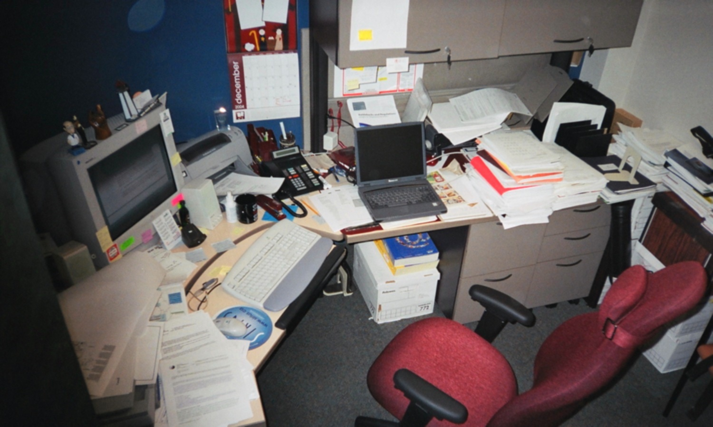
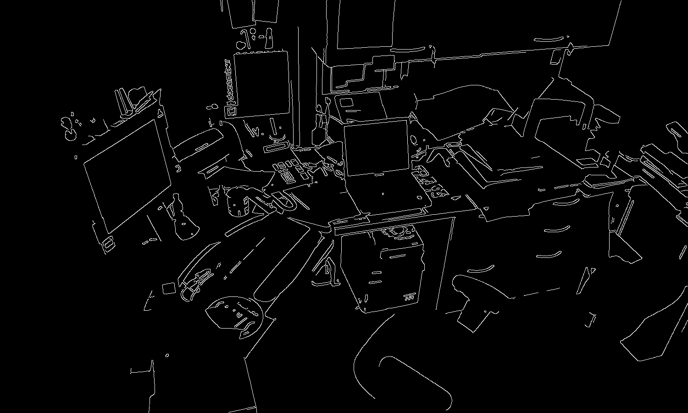
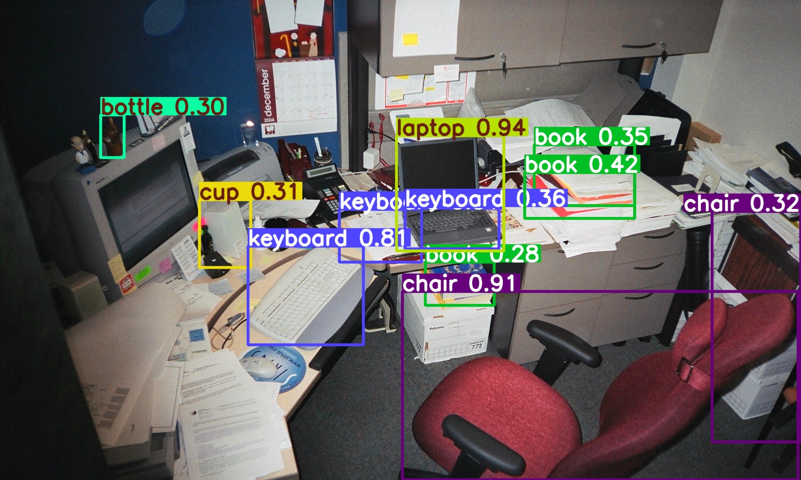

# Procesamiento de Imágenes con YOLOv8

## 🚀 Funcionamiento del código

1. **Entrada**: Sube cualquier imagen cuando el código lo solicite

2. **Procesamiento**:
   - Aplica filtro Gaussiano para suavizado
   - Detecta bordes con el algoritmo Canny

3. **Detección**: 
   - Usa YOLOv8 pre-entrenado para identificar objetos
   - Dibuja bounding boxes con etiquetas

4. **Salida**: 
   - Muestra 4 imágenes:
     1. Original
     2. Suavizada  
     3. Bordes
     4. Detección de objetos

## 💻 Requisitos
```bash
pip install ultralytics opencv-python numpy matplotlib torch
```
## 📸 Visualización de Resultados

### 2. Imagen Suavizada (Filtro Gaussiano)


### 3. Bordes Detectados (Algoritmo Canny)


### 4. Detección de Objetos (YOLOv8)

