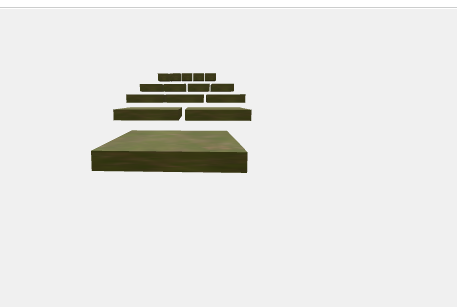

# Pirámide Escalonada 3D con React Three Fiber
Lo realice en un proyecto en local, en la carpeta "piramide-3d" esta todo mi codigo.
## Características
- Pirámide 3D escalonada con 5 niveles
- Materiales PBR (diffuse,)
- Controles de cámara interactivos

## Tecnologías
- React Three Fiber
- Three.js
- @react-three/drei

## Texturas utilizadas
Descargadas de [AmbientCG](https://ambientcg.com):

