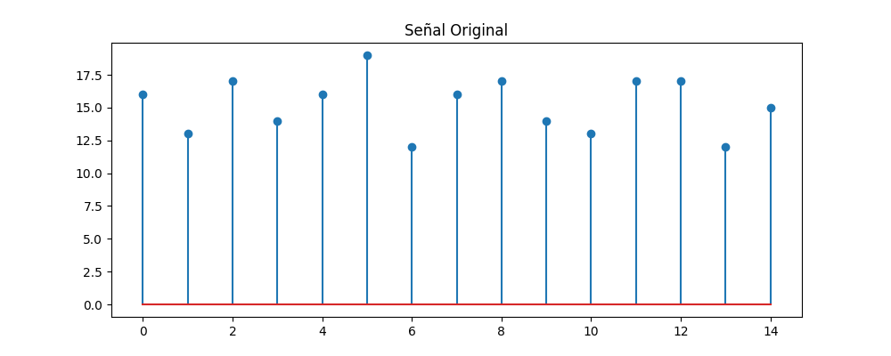
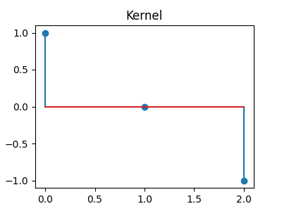
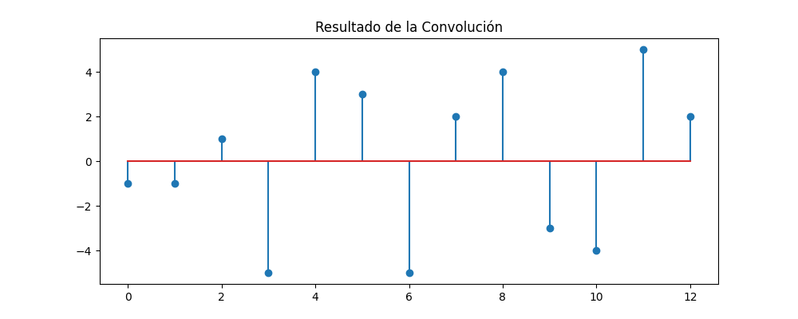

# 🧠 Ejercicio 3: Convolución 1D Manual

Este script implementa una operación de convolución 1D entre una señal y un kernel, visualiza los resultados y guarda los gráficos generados.

## 📌 Descripción de los pasos

1. **Función de Convolución Manual**
   - Se define la función `convolucion_1d` que recorre manualmente la señal y aplica el kernel punto a punto.
   - El resultado se calcula como la suma del producto entre segmentos de la señal y el kernel.

2. **Generación de Datos**
   - Se genera una señal aleatoria de 15 valores entre 10 y 20 usando `numpy`.
   - Se define un kernel fijo: `[1, 0, -1]`, usado comúnmente para detección de bordes.

3. **Aplicación de la Convolución**
   - Se llama la función `convolucion_1d` con la señal y el kernel para obtener el resultado.

4. **Visualización de Resultados**
   - Se grafican:
     - La señal original
     - El kernel
     - El resultado de la convolución
   - Se usan gráficos de tipo stem (diagrama de tallo) con `matplotlib`.

5. **Guardar Imágenes**
   - Los gráficos se guardan en la ruta `ejercicio_3_convolucion_1d/graficos/` con nombres descriptivos:
     - `senal_original.png`
     - `kernel.png`
     - `resultado.png`

6. **Impresión en Consola**
   - Se muestran por consola los valores de la señal, el kernel y el resultado final.

## 📁 Archivos generados

- Carpeta: `ejercicio_3_convolucion_1d/graficos/`
  - `senal_original.png`
  - `kernel.png`
  - `resultado.png`

## Resultados

